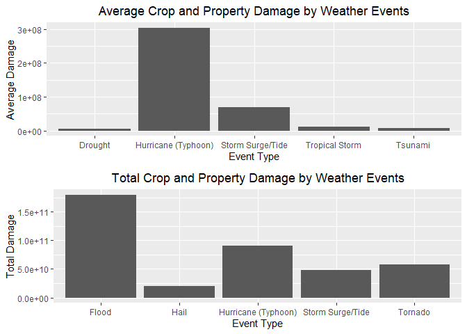
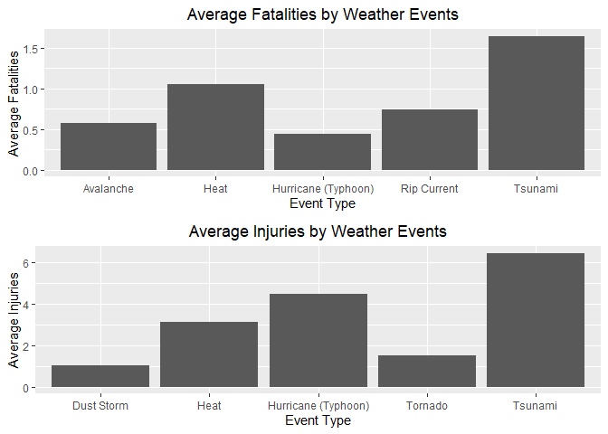
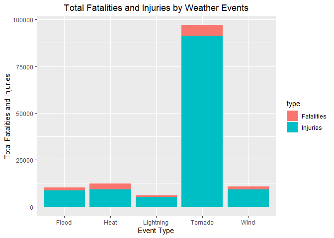

## Synopsis
In this report we aim to identify the most harmful severe weather events in the United States. We explore which types of weather events are most harmful to population health, as well as which types of events have the greatest economic impact. For our analysis, we use data from U.S. National Oceanic and Atmospheric Administration's (NOAA) storm database (found [here](https://d396qusza40orc.cloudfront.net/repdata%2Fdata%2FStormData.csv.bz2), with corresponding documentation [here](https://d396qusza40orc.cloudfront.net/repdata%2Fpeer2_doc%2Fpd01016005curr.pdf)). The database tracks characteristics of major storms and weather events in the United States, including when and where they occur, as well as estimates of any fatalities, injuries, and property damage. The data we use for our analysis includes events from 1950 to November 2011. Based on the data we find the weather events that caused the most combined property and crop damage on average, the most fatalities on average, and the most injuries on average, as well as which weather events caused the most total combined property and crop damage, and the most total combined fatalities and injuries. We infer from this analysis which weather events have the greatest economic impact and are the most harmful to population health.

## Data Processing

### Reading in the Data
We break up the processing of the data for our analysis into three scripts. The first script, read_data.R, downloads the zip file containing the data to the current working directory if necessary, reads the data into R, and then returns a data frame containing the data (Due to the size of the data, this script might take a bit of time to run):


```r
# Download data to working directory if necessary
if(!file.exists("StormData.csv.bz2")){
      # Download zip file
      url <- "https://d396qusza40orc.cloudfront.net/repdata%2Fdata%2FStormData.csv.bz2"
      download.file(url, destfile = "StormData.csv.bz2")
}
      
data <- read.csv("StormData.csv.bz2")
data
```

### Reformatting and Consolidating Event Types
Taking a quick look at the levels of the *EVTYPE* variable, which indicates the type of weather event for each observation, we have the following:


```r
unique(data$EVTYPE)
```

```
##   [1] TORNADO                        TSTM WIND                     
##   [3] HAIL                           FREEZING RAIN                 
##   [5] SNOW                           ICE STORM/FLASH FLOOD         
##   [7] SNOW/ICE                       WINTER STORM                  
##   [9] HURRICANE OPAL/HIGH WINDS      THUNDERSTORM WINDS            
##  [11] RECORD COLD                    HURRICANE ERIN                
##  [13] HURRICANE OPAL                 HEAVY RAIN                    
##  [15] LIGHTNING                      THUNDERSTORM WIND             
##  [17] DENSE FOG                      RIP CURRENT                   
##  [19] THUNDERSTORM WINS              FLASH FLOOD                   
##  [21] FLASH FLOODING                 HIGH WINDS                    
##  [23] FUNNEL CLOUD                   TORNADO F0                    
##  [25] THUNDERSTORM WINDS LIGHTNING   THUNDERSTORM WINDS/HAIL       
##  [27] HEAT                           WIND                          
##  [29] LIGHTING                       HEAVY RAINS                   
##  [31] LIGHTNING AND HEAVY RAIN       FUNNEL                        
##  [33] WALL CLOUD                     FLOODING                      
##  [35] THUNDERSTORM WINDS HAIL        FLOOD                         
##  [37] COLD                           HEAVY RAIN/LIGHTNING          
##  [39] FLASH FLOODING/THUNDERSTORM WI WALL CLOUD/FUNNEL CLOUD       
##  [41] THUNDERSTORM                   WATERSPOUT                    
##  [43] EXTREME COLD                   HAIL 1.75)                    
##  [45] LIGHTNING/HEAVY RAIN           HIGH WIND                     
##  [47] BLIZZARD                       BLIZZARD WEATHER              
##  [49] WIND CHILL                     BREAKUP FLOODING              
##  [51] HIGH WIND/BLIZZARD             RIVER FLOOD                   
##  [53] HEAVY SNOW                     FREEZE                        
##  [55] COASTAL FLOOD                  HIGH WIND AND HIGH TIDES      
##  [57] HIGH WIND/BLIZZARD/FREEZING RA HIGH TIDES                    
##  [59] HIGH WIND AND HEAVY SNOW       RECORD COLD AND HIGH WIND     
##  [61] RECORD HIGH TEMPERATURE        RECORD HIGH                   
##  [63] HIGH WINDS HEAVY RAINS         HIGH WIND/ BLIZZARD           
##  [65] ICE STORM                      BLIZZARD/HIGH WIND            
##  [67] HIGH WIND/LOW WIND CHILL       HEAVY SNOW/HIGH               
##  [69] RECORD LOW                     HIGH WINDS AND WIND CHILL     
##  [71] HEAVY SNOW/HIGH WINDS/FREEZING LOW TEMPERATURE RECORD        
##  [73] AVALANCHE                      MARINE MISHAP                 
##  [75] WIND CHILL/HIGH WIND           HIGH WIND/WIND CHILL/BLIZZARD 
##  [77] HIGH WIND/WIND CHILL           HIGH WIND/HEAVY SNOW          
##  [79] HIGH TEMPERATURE RECORD        FLOOD WATCH/                  
##  [81] RECORD HIGH TEMPERATURES       HIGH WIND/SEAS                
##  [83] HIGH WINDS/HEAVY RAIN          HIGH SEAS                     
##  [85] SEVERE TURBULENCE              RECORD RAINFALL               
##  [87] RECORD SNOWFALL                RECORD WARMTH                 
##  [89] HEAVY SNOW/WIND                EXTREME HEAT                  
##  [91] WIND DAMAGE                    DUST STORM                    
##  [93] APACHE COUNTY                  SLEET                         
##  [95] HAIL STORM                     FUNNEL CLOUDS                 
##  [97] FLASH FLOODS                   DUST DEVIL                    
##  [99] EXCESSIVE HEAT                 THUNDERSTORM WINDS/FUNNEL CLOU
## [101] WINTER STORM/HIGH WIND         WINTER STORM/HIGH WINDS       
## [103] GUSTY WINDS                    STRONG WINDS                  
## [105] FLOODING/HEAVY RAIN            SNOW AND WIND                 
## [107] HEAVY SURF COASTAL FLOODING    HEAVY SURF                    
## [109] HEAVY PRECIPATATION            URBAN FLOODING                
## [111] HIGH SURF                      BLOWING DUST                  
## [113] URBAN/SMALL                    WILD FIRES                    
## [115] HIGH                           URBAN/SMALL FLOODING          
## [117] WATER SPOUT                    HIGH WINDS DUST STORM         
## [119] WINTER STORM HIGH WINDS        LOCAL FLOOD                   
## [121] WINTER STORMS                  MUDSLIDES                     
## [123] RAINSTORM                      SEVERE THUNDERSTORM           
## [125] SEVERE THUNDERSTORMS           SEVERE THUNDERSTORM WINDS     
## [127] THUNDERSTORMS WINDS            DRY MICROBURST                
## [129] FLOOD/FLASH FLOOD              FLOOD/RAIN/WINDS              
## [131] WINDS                          DRY MICROBURST 61             
## [133] THUNDERSTORMS                  FLASH FLOOD WINDS             
## [135] URBAN/SMALL STREAM FLOODING    MICROBURST                    
## [137] STRONG WIND                    HIGH WIND DAMAGE              
## [139] STREAM FLOODING                URBAN AND SMALL               
## [141] HEAVY SNOWPACK                 ICE                           
## [143] FLASH FLOOD/                   DOWNBURST                     
## [145] GUSTNADO AND                   FLOOD/RAIN/WIND               
## [147] WET MICROBURST                 DOWNBURST WINDS               
## [149] DRY MICROBURST WINDS           DRY MIRCOBURST WINDS          
## [151] DRY MICROBURST 53              SMALL STREAM URBAN FLOOD      
## [153] MICROBURST WINDS               HIGH WINDS 57                 
## [155] DRY MICROBURST 50              HIGH WINDS 66                 
## [157] HIGH WINDS 76                  HIGH WINDS 63                 
## [159] HIGH WINDS 67                  BLIZZARD/HEAVY SNOW           
## [161] HEAVY SNOW/HIGH WINDS          BLOWING SNOW                  
## [163] HIGH WINDS 82                  HIGH WINDS 80                 
## [165] HIGH WINDS 58                  FREEZING DRIZZLE              
## [167] LIGHTNING THUNDERSTORM WINDSS  DRY MICROBURST 58             
## [169] HAIL 75                        HIGH WINDS 73                 
## [171] HIGH WINDS 55                  LIGHT SNOW AND SLEET          
## [173] URBAN FLOOD                    DRY MICROBURST 84             
## [175] THUNDERSTORM WINDS 60          HEAVY RAIN/FLOODING           
## [177] THUNDERSTORM WINDSS            TORNADOS                      
## [179] GLAZE                          RECORD HEAT                   
## [181] COASTAL FLOODING               HEAT WAVE                     
## [183] FIRST SNOW                     FREEZING RAIN AND SLEET       
## [185] UNSEASONABLY DRY               UNSEASONABLY WET              
## [187] WINTRY MIX                     WINTER WEATHER                
## [189] UNSEASONABLY COLD              EXTREME/RECORD COLD           
## [191] RIP CURRENTS HEAVY SURF        SLEET/RAIN/SNOW               
## [193] UNSEASONABLY WARM              DROUGHT                       
## [195] NORMAL PRECIPITATION           HIGH WINDS/FLOODING           
## [197] DRY                            RAIN/SNOW                     
## [199] SNOW/RAIN/SLEET                WATERSPOUT/TORNADO            
## [201] WATERSPOUTS                    WATERSPOUT TORNADO            
## [203] URBAN/SMALL STREAM FLOOD       STORM SURGE                   
## [205] WATERSPOUT-TORNADO             WATERSPOUT-                   
## [207] TORNADOES, TSTM WIND, HAIL     TROPICAL STORM ALBERTO        
## [209] TROPICAL STORM                 TROPICAL STORM GORDON         
## [211] TROPICAL STORM JERRY           LIGHTNING THUNDERSTORM WINDS  
## [213] WAYTERSPOUT                    MINOR FLOODING                
## [215] LIGHTNING INJURY               URBAN/SMALL STREAM  FLOOD     
## [217] LIGHTNING AND THUNDERSTORM WIN THUNDERSTORM WINDS53          
## [219] URBAN AND SMALL STREAM FLOOD   URBAN AND SMALL STREAM        
## [221] WILDFIRE                       DAMAGING FREEZE               
## [223] THUNDERSTORM WINDS 13          SMALL HAIL                    
## [225] HEAVY SNOW/HIGH WIND           HURRICANE                     
## [227] WILD/FOREST FIRE               SMALL STREAM FLOODING         
## [229] MUD SLIDE                      LIGNTNING                     
## [231] FROST                          FREEZING RAIN/SNOW            
## [233] HIGH WINDS/                    THUNDERSNOW                   
## [235] FLOODS                         EXTREME WIND CHILLS           
## [237] COOL AND WET                   HEAVY RAIN/SNOW               
## [239] SMALL STREAM AND URBAN FLOODIN SMALL STREAM/URBAN FLOOD      
## [241] SNOW/SLEET/FREEZING RAIN       SEVERE COLD                   
## [243] GLAZE ICE                      COLD WAVE                     
## [245] EARLY SNOW                     SMALL STREAM AND URBAN FLOOD  
## [247] HIGH  WINDS                    RURAL FLOOD                   
## [249] SMALL STREAM AND               MUD SLIDES                    
## [251] HAIL 80                        EXTREME WIND CHILL            
## [253] COLD AND WET CONDITIONS        EXCESSIVE WETNESS             
## [255] GRADIENT WINDS                 HEAVY SNOW/BLOWING SNOW       
## [257] SLEET/ICE STORM                THUNDERSTORM WINDS URBAN FLOOD
## [259] THUNDERSTORM WINDS SMALL STREA ROTATING WALL CLOUD           
## [261] LARGE WALL CLOUD               COLD AIR FUNNEL               
## [263] GUSTNADO                       COLD AIR FUNNELS              
## [265] BLOWING SNOW- EXTREME WIND CHI SNOW AND HEAVY SNOW           
## [267] GROUND BLIZZARD                MAJOR FLOOD                   
## [269] SNOW/HEAVY SNOW                FREEZING RAIN/SLEET           
## [271] ICE JAM FLOODING               SNOW- HIGH WIND- WIND CHILL   
## [273] STREET FLOOD                   COLD AIR TORNADO              
## [275] SMALL STREAM FLOOD             FOG                           
## [277] THUNDERSTORM WINDS 2           FUNNEL CLOUD/HAIL             
## [279] ICE/SNOW                       TSTM WIND 51                  
## [281] TSTM WIND 50                   TSTM WIND 52                  
## [283] TSTM WIND 55                   HEAVY SNOW/BLIZZARD           
## [285] THUNDERSTORM WINDS 61          HAIL 0.75                     
## [287] THUNDERSTORM DAMAGE            THUNDERTORM WINDS             
## [289] HAIL 1.00                      HAIL/WINDS                    
## [291] SNOW AND ICE                   WIND STORM                    
## [293] SNOWSTORM                      GRASS FIRES                   
## [295] LAKE FLOOD                     PROLONG COLD                  
## [297] HAIL/WIND                      HAIL 1.75                     
## [299] THUNDERSTORMW 50               WIND/HAIL                     
## [301] SNOW AND ICE STORM             URBAN AND SMALL STREAM FLOODIN
## [303] THUNDERSTORMS WIND             THUNDERSTORM  WINDS           
## [305] HEAVY SNOW/SLEET               AGRICULTURAL FREEZE           
## [307] DROUGHT/EXCESSIVE HEAT         TUNDERSTORM WIND              
## [309] TROPICAL STORM DEAN            THUNDERTSORM WIND             
## [311] THUNDERSTORM WINDS/ HAIL       THUNDERSTORM WIND/LIGHTNING   
## [313] HEAVY RAIN/SEVERE WEATHER      THUNDESTORM WINDS             
## [315] WATERSPOUT/ TORNADO            LIGHTNING.                    
## [317] WARM DRY CONDITIONS            HURRICANE-GENERATED SWELLS    
## [319] HEAVY SNOW/ICE STORM           RIVER AND STREAM FLOOD        
## [321] HIGH WIND 63                   COASTAL SURGE                 
## [323] HEAVY SNOW AND ICE STORM       MINOR FLOOD                   
## [325] HIGH WINDS/COASTAL FLOOD       RAIN                          
## [327] RIVER FLOODING                 SNOW/RAIN                     
## [329] ICE FLOES                      HIGH WAVES                    
## [331] SNOW SQUALLS                   SNOW SQUALL                   
## [333] THUNDERSTORM WIND G50          LIGHTNING FIRE                
## [335] BLIZZARD/FREEZING RAIN         HEAVY LAKE SNOW               
## [337] HEAVY SNOW/FREEZING RAIN       LAKE EFFECT SNOW              
## [339] HEAVY WET SNOW                 DUST DEVIL WATERSPOUT         
## [341] THUNDERSTORM WINDS/HEAVY RAIN  THUNDERSTROM WINDS            
## [343] THUNDERSTORM WINDS      LE CEN HAIL 225                      
## [345] BLIZZARD AND HEAVY SNOW        HEAVY SNOW AND ICE            
## [347] ICE STORM AND SNOW             HEAVY SNOW ANDBLOWING SNOW    
## [349] HEAVY SNOW/ICE                 BLIZZARD AND EXTREME WIND CHIL
## [351] LOW WIND CHILL                 BLOWING SNOW & EXTREME WIND CH
## [353] WATERSPOUT/                    URBAN/SMALL STREAM            
## [355] TORNADO F3                     FUNNEL CLOUD.                 
## [357] TORNDAO                        HAIL 0.88                     
## [359] FLOOD/RIVER FLOOD              MUD SLIDES URBAN FLOODING     
## [361] TORNADO F1                     THUNDERSTORM WINDS G          
## [363] DEEP HAIL                      GLAZE/ICE STORM               
## [365] HEAVY SNOW/WINTER STORM        AVALANCE                      
## [367] BLIZZARD/WINTER STORM          DUST STORM/HIGH WINDS         
## [369] ICE JAM                        FOREST FIRES                  
## [371] THUNDERSTORM WIND G60          FROST\\FREEZE                 
## [373] THUNDERSTORM WINDS.            HAIL 88                       
## [375] HAIL 175                       HVY RAIN                      
## [377] HAIL 100                       HAIL 150                      
## [379] HAIL 075                       THUNDERSTORM WIND G55         
## [381] HAIL 125                       THUNDERSTORM WINDS G60        
## [383] HARD FREEZE                    HAIL 200                      
## [385] THUNDERSTORM WINDS FUNNEL CLOU THUNDERSTORM WINDS 62         
## [387] WILDFIRES                      RECORD HEAT WAVE              
## [389] HEAVY SNOW AND HIGH WINDS      HEAVY SNOW/HIGH WINDS & FLOOD 
## [391] HAIL FLOODING                  THUNDERSTORM WINDS/FLASH FLOOD
## [393] HIGH WIND 70                   WET SNOW                      
## [395] HEAVY RAIN AND FLOOD           LOCAL FLASH FLOOD             
## [397] THUNDERSTORM WINDS 53          FLOOD/FLASH FLOODING          
## [399] TORNADO/WATERSPOUT             RAIN AND WIND                 
## [401] THUNDERSTORM WIND 59           THUNDERSTORM WIND 52          
## [403] COASTAL/TIDAL FLOOD            SNOW/ICE STORM                
## [405] BELOW NORMAL PRECIPITATION     RIP CURRENTS/HEAVY SURF       
## [407] FLASH FLOOD/FLOOD              EXCESSIVE RAIN                
## [409] RECORD/EXCESSIVE HEAT          HEAT WAVES                    
## [411] LIGHT SNOW                     THUNDERSTORM WIND 69          
## [413] HAIL DAMAGE                    LIGHTNING DAMAGE              
## [415] RECORD TEMPERATURES            LIGHTNING AND WINDS           
## [417] FOG AND COLD TEMPERATURES      OTHER                         
## [419] RECORD SNOW                    SNOW/COLD                     
## [421] FLASH FLOOD FROM ICE JAMS      TSTM WIND G58                 
## [423] MUDSLIDE                       HEAVY SNOW SQUALLS            
## [425] HEAVY SNOW/SQUALLS             HEAVY SNOW-SQUALLS            
## [427] ICY ROADS                      HEAVY MIX                     
## [429] SNOW FREEZING RAIN             LACK OF SNOW                  
## [431] SNOW/SLEET                     SNOW/FREEZING RAIN            
## [433] SNOW DROUGHT                   THUNDERSTORMW WINDS           
## [435] THUNDERSTORM WIND 60 MPH       THUNDERSTORM WIND 65MPH       
## [437] THUNDERSTORM WIND/ TREES       THUNDERSTORM WIND/AWNING      
## [439] THUNDERSTORM WIND 98 MPH       THUNDERSTORM WIND TREES       
## [441] TORRENTIAL RAIN                TORNADO F2                    
## [443] RIP CURRENTS                   HURRICANE EMILY               
## [445] HURRICANE GORDON               HURRICANE FELIX               
## [447] THUNDERSTORM WIND 59 MPH       THUNDERSTORM WINDS 63 MPH     
## [449] THUNDERSTORM WIND/ TREE        THUNDERSTORM DAMAGE TO        
## [451] THUNDERSTORM WIND 65 MPH       FLASH FLOOD - HEAVY RAIN      
## [453] THUNDERSTORM WIND.             FLASH FLOOD/ STREET           
## [455] THUNDERSTORM WIND 59 MPH.      HEAVY SNOW   FREEZING RAIN    
## [457] DAM FAILURE                    THUNDERSTORM HAIL             
## [459] HAIL 088                       THUNDERSTORM WINDSHAIL        
## [461] LIGHTNING  WAUSEON             THUDERSTORM WINDS             
## [463] ICE AND SNOW                   RECORD COLD/FROST             
## [465] STORM FORCE WINDS              FREEZING RAIN AND SNOW        
## [467] FREEZING RAIN SLEET AND        SOUTHEAST                     
## [469] HEAVY SNOW & ICE               FREEZING DRIZZLE AND FREEZING 
## [471] THUNDERSTORM WINDS AND         HAIL/ICY ROADS                
## [473] FLASH FLOOD/HEAVY RAIN         HEAVY RAIN; URBAN FLOOD WINDS;
## [475] HEAVY PRECIPITATION            TSTM WIND DAMAGE              
## [477] HIGH WATER                     FLOOD FLASH                   
## [479] RAIN/WIND                      THUNDERSTORM WINDS 50         
## [481] THUNDERSTORM WIND G52          FLOOD FLOOD/FLASH             
## [483] THUNDERSTORM WINDS 52          SNOW SHOWERS                  
## [485] THUNDERSTORM WIND G51          HEAT WAVE DROUGHT             
## [487] HEAVY SNOW/BLIZZARD/AVALANCHE  RECORD SNOW/COLD              
## [489] WET WEATHER                    UNSEASONABLY WARM AND DRY     
## [491] FREEZING RAIN SLEET AND LIGHT  RECORD/EXCESSIVE RAINFALL     
## [493] TIDAL FLOOD                    BEACH EROSIN                  
## [495] THUNDERSTORM WIND G61          FLOOD/FLASH                   
## [497] LOW TEMPERATURE                SLEET & FREEZING RAIN         
## [499] HEAVY RAINS/FLOODING           THUNDERESTORM WINDS           
## [501] THUNDERSTORM WINDS/FLOODING    THUNDEERSTORM WINDS           
## [503] HIGHWAY FLOODING               THUNDERSTORM W INDS           
## [505] HYPOTHERMIA                    FLASH FLOOD/ FLOOD            
## [507] THUNDERSTORM WIND 50           THUNERSTORM WINDS             
## [509] HEAVY RAIN/MUDSLIDES/FLOOD     MUD/ROCK SLIDE                
## [511] HIGH WINDS/COLD                BEACH EROSION/COASTAL FLOOD   
## [513] COLD/WINDS                     SNOW/ BITTER COLD             
## [515] THUNDERSTORM WIND 56           SNOW SLEET                    
## [517] DRY HOT WEATHER                COLD WEATHER                  
## [519] RAPIDLY RISING WATER           HAIL ALOFT                    
## [521] EARLY FREEZE                   ICE/STRONG WINDS              
## [523] EXTREME WIND CHILL/BLOWING SNO SNOW/HIGH WINDS               
## [525] HIGH WINDS/SNOW                EARLY FROST                   
## [527] SNOWMELT FLOODING              HEAVY SNOW AND STRONG WINDS   
## [529] SNOW ACCUMULATION              BLOWING SNOW/EXTREME WIND CHIL
## [531] SNOW/ ICE                      SNOW/BLOWING SNOW             
## [533] TORNADOES                      THUNDERSTORM WIND/HAIL        
## [535] FLASH FLOODING/FLOOD           HAIL 275                      
## [537] HAIL 450                       FLASH FLOOODING               
## [539] EXCESSIVE RAINFALL             THUNDERSTORMW                 
## [541] HAILSTORM                      TSTM WINDS                    
## [543] BEACH FLOOD                    HAILSTORMS                    
## [545] TSTMW                          FUNNELS                       
## [547] TSTM WIND 65)                  THUNDERSTORM WINDS/ FLOOD     
## [549] HEAVY RAINFALL                 HEAT/DROUGHT                  
## [551] HEAT DROUGHT                   NEAR RECORD SNOW              
## [553] LANDSLIDE                      HIGH WIND AND SEAS            
## [555] THUNDERSTORMWINDS              THUNDERSTORM WINDS HEAVY RAIN 
## [557] SLEET/SNOW                     EXCESSIVE                     
## [559] SNOW/SLEET/RAIN                WILD/FOREST FIRES             
## [561] HEAVY SEAS                     DUSTSTORM                     
## [563] FLOOD & HEAVY RAIN             ?                             
## [565] THUNDERSTROM WIND              FLOOD/FLASHFLOOD              
## [567] SNOW AND COLD                  HOT PATTERN                   
## [569] PROLONG COLD/SNOW              BRUSH FIRES                   
## [571] SNOW\\COLD                     WINTER MIX                    
## [573] EXCESSIVE PRECIPITATION        SNOWFALL RECORD               
## [575] HOT/DRY PATTERN                DRY PATTERN                   
## [577] MILD/DRY PATTERN               MILD PATTERN                  
## [579] LANDSLIDES                     HEAVY SHOWERS                 
## [581] HEAVY SNOW AND                 HIGH WIND 48                  
## [583] LAKE-EFFECT SNOW               BRUSH FIRE                    
## [585] WATERSPOUT FUNNEL CLOUD        URBAN SMALL STREAM FLOOD      
## [587] SAHARAN DUST                   HEAVY SHOWER                  
## [589] URBAN FLOOD LANDSLIDE          HEAVY SWELLS                  
## [591] URBAN SMALL                    URBAN FLOODS                  
## [593] SMALL STREAM                   HEAVY RAIN/URBAN FLOOD        
## [595] FLASH FLOOD/LANDSLIDE          LANDSLIDE/URBAN FLOOD         
## [597] HEAVY RAIN/SMALL STREAM URBAN  FLASH FLOOD LANDSLIDES        
## [599] EXTREME WINDCHILL              URBAN/SML STREAM FLD          
## [601] TSTM WIND/HAIL                 Other                         
## [603] Record dry month               Temperature record            
## [605] Minor Flooding                 Ice jam flood (minor          
## [607] High Wind                      Tstm Wind                     
## [609] ROUGH SURF                     Wind                          
## [611] Heavy Surf                     Dust Devil                    
## [613] Wind Damage                    Marine Accident               
## [615] Snow                           Freeze                        
## [617] Snow Squalls                   Coastal Flooding              
## [619] Heavy Rain                     Strong Wind                   
## [621] COASTAL STORM                  COASTALFLOOD                  
## [623] Erosion/Cstl Flood             Heavy Rain and Wind           
## [625] Light Snow/Flurries            Wet Month                     
## [627] Wet Year                       Tidal Flooding                
## [629] River Flooding                 Damaging Freeze               
## [631] Beach Erosion                  Hot and Dry                   
## [633] Flood/Flash Flood              Icy Roads                     
## [635] High Surf                      Heavy Rain/High Surf          
## [637] Thunderstorm Wind              Rain Damage                   
## [639] Unseasonable Cold              Early Frost                   
## [641] Wintry Mix                     blowing snow                  
## [643] STREET FLOODING                Record Cold                   
## [645] Extreme Cold                   Ice Fog                       
## [647] Excessive Cold                 Torrential Rainfall           
## [649] Freezing Rain                  Landslump                     
## [651] Late-season Snowfall           Hurricane Edouard             
## [653] Coastal Storm                  Flood                         
## [655] HEAVY RAIN/WIND                TIDAL FLOODING                
## [657] Winter Weather                 Snow squalls                  
## [659] Strong Winds                   Strong winds                  
## [661] RECORD WARM TEMPS.             Ice/Snow                      
## [663] Mudslide                       Glaze                         
## [665] Extended Cold                  Snow Accumulation             
## [667] Freezing Fog                   Drifting Snow                 
## [669] Whirlwind                      Heavy snow shower             
## [671] Heavy rain                     LATE SNOW                     
## [673] Record May Snow                Record Winter Snow            
## [675] Heavy Precipitation             COASTAL FLOOD                
## [677] Record temperature             Light snow                    
## [679] Late Season Snowfall           Gusty Wind                    
## [681] small hail                     Light Snow                    
## [683] MIXED PRECIP                   Black Ice                     
## [685] Mudslides                      Gradient wind                 
## [687] Snow and Ice                   Freezing Spray                
## [689] Summary Jan 17                 Summary of March 14           
## [691] Summary of March 23            Summary of March 24           
## [693] Summary of April 3rd           Summary of April 12           
## [695] Summary of April 13            Summary of April 21           
## [697] Summary August 11              Summary of April 27           
## [699] Summary of May 9-10            Summary of May 10             
## [701] Summary of May 13              Summary of May 14             
## [703] Summary of May 22 am           Summary of May 22 pm          
## [705] Heatburst                      Summary of May 26 am          
## [707] Summary of May 26 pm           Metro Storm, May 26           
## [709] Summary of May 31 am           Summary of May 31 pm          
## [711] Summary of June 3              Summary of June 4             
## [713] Summary June 5-6               Summary June 6                
## [715] Summary of June 11             Summary of June 12            
## [717] Summary of June 13             Summary of June 15            
## [719] Summary of June 16             Summary June 18-19            
## [721] Summary of June 23             Summary of June 24            
## [723] Summary of June 30             Summary of July 2             
## [725] Summary of July 3              Summary of July 11            
## [727] Summary of July 22             Summary July 23-24            
## [729] Summary of July 26             Summary of July 29            
## [731] Summary of August 1            Summary August 2-3            
## [733] Summary August 7               Summary August 9              
## [735] Summary August 10              Summary August 17             
## [737] Summary August 21              Summary August 28             
## [739] Summary September 4            Summary September 20          
## [741] Summary September 23           Summary Sept. 25-26           
## [743] Summary: Oct. 20-21            Summary: October 31           
## [745] Summary: Nov. 6-7              Summary: Nov. 16              
## [747] Microburst                     wet micoburst                 
## [749] Hail(0.75)                     Funnel Cloud                  
## [751] Urban Flooding                 No Severe Weather             
## [753] Urban flood                    Urban Flood                   
## [755] Cold                           Summary of May 22             
## [757] Summary of June 6              Summary August 4              
## [759] Summary of June 10             Summary of June 18            
## [761] Summary September 3            Summary: Sept. 18             
## [763] Coastal Flood                  coastal flooding              
## [765] Small Hail                     Record Temperatures           
## [767] Light Snowfall                 Freezing Drizzle              
## [769] Gusty wind/rain                GUSTY WIND/HVY RAIN           
## [771] Blowing Snow                   Early snowfall                
## [773] Monthly Snowfall               Record Heat                   
## [775] Seasonal Snowfall              Monthly Rainfall              
## [777] Cold Temperature               Sml Stream Fld                
## [779] Heat Wave                      MUDSLIDE/LANDSLIDE            
## [781] Saharan Dust                   Volcanic Ash                  
## [783] Volcanic Ash Plume             Thundersnow shower            
## [785] NONE                           COLD AND SNOW                 
## [787] DAM BREAK                      TSTM WIND (G45)               
## [789] SLEET/FREEZING RAIN            BLACK ICE                     
## [791] BLOW-OUT TIDES                 UNSEASONABLY COOL             
## [793] TSTM HEAVY RAIN                Gusty Winds                   
## [795] GUSTY WIND                     TSTM WIND 40                  
## [797] TSTM WIND 45                   TSTM WIND (41)                
## [799] TSTM WIND (G40)                TSTM WND                      
## [801] Wintry mix                      TSTM WIND                    
## [803] Frost                          Frost/Freeze                  
## [805] RAIN (HEAVY)                   Record Warmth                 
## [807] Prolong Cold                   Cold and Frost                
## [809] URBAN/SML STREAM FLDG          STRONG WIND GUST              
## [811] LATE FREEZE                    BLOW-OUT TIDE                 
## [813] Hypothermia/Exposure           HYPOTHERMIA/EXPOSURE          
## [815] Lake Effect Snow               Mixed Precipitation           
## [817] Record High                    COASTALSTORM                  
## [819] Snow and sleet                 Freezing rain                 
## [821] Gusty winds                    Blizzard Summary              
## [823] SUMMARY OF MARCH 24-25         SUMMARY OF MARCH 27           
## [825] SUMMARY OF MARCH 29            GRADIENT WIND                 
## [827] Icestorm/Blizzard              Flood/Strong Wind             
## [829] TSTM WIND AND LIGHTNING        gradient wind                 
## [831] Freezing drizzle               Mountain Snows                
## [833] URBAN/SMALL STRM FLDG          Heavy surf and wind           
## [835] Mild and Dry Pattern           COLD AND FROST                
## [837] TYPHOON                        HIGH SWELLS                   
## [839] HIGH  SWELLS                   VOLCANIC ASH                  
## [841] DRY SPELL                       LIGHTNING                    
## [843] BEACH EROSION                  UNSEASONAL RAIN               
## [845] EARLY RAIN                     PROLONGED RAIN                
## [847] WINTERY MIX                    COASTAL FLOODING/EROSION      
## [849] HOT SPELL                      UNSEASONABLY HOT              
## [851]  TSTM WIND (G45)               TSTM WIND  (G45)              
## [853] HIGH WIND (G40)                TSTM WIND (G35)               
## [855] DRY WEATHER                    ABNORMAL WARMTH               
## [857] UNUSUAL WARMTH                 WAKE LOW WIND                 
## [859] MONTHLY RAINFALL               COLD TEMPERATURES             
## [861] COLD WIND CHILL TEMPERATURES   MODERATE SNOW                 
## [863] MODERATE SNOWFALL              URBAN/STREET FLOODING         
## [865] COASTAL EROSION                UNUSUAL/RECORD WARMTH         
## [867] BITTER WIND CHILL              BITTER WIND CHILL TEMPERATURES
## [869] SEICHE                         TSTM                          
## [871] COASTAL  FLOODING/EROSION      UNSEASONABLY WARM YEAR        
## [873] HYPERTHERMIA/EXPOSURE          ROCK SLIDE                    
## [875] ICE PELLETS                    PATCHY DENSE FOG              
## [877] RECORD COOL                    RECORD WARM                   
## [879] HOT WEATHER                    RECORD TEMPERATURE            
## [881] TROPICAL DEPRESSION            VOLCANIC ERUPTION             
## [883] COOL SPELL                     WIND ADVISORY                 
## [885] GUSTY WIND/HAIL                RED FLAG FIRE WX              
## [887] FIRST FROST                    EXCESSIVELY DRY               
## [889] SNOW AND SLEET                 LIGHT SNOW/FREEZING PRECIP    
## [891] VOG                            MONTHLY PRECIPITATION         
## [893] MONTHLY TEMPERATURE            RECORD DRYNESS                
## [895] EXTREME WINDCHILL TEMPERATURES MIXED PRECIPITATION           
## [897] DRY CONDITIONS                 REMNANTS OF FLOYD             
## [899] EARLY SNOWFALL                 FREEZING FOG                  
## [901] LANDSPOUT                      DRIEST MONTH                  
## [903] RECORD  COLD                   LATE SEASON HAIL              
## [905] EXCESSIVE SNOW                 DRYNESS                       
## [907] FLOOD/FLASH/FLOOD              WIND AND WAVE                 
## [909] LIGHT FREEZING RAIN             WIND                         
## [911] MONTHLY SNOWFALL               RECORD PRECIPITATION          
## [913] ICE ROADS                      ROUGH SEAS                    
## [915] UNSEASONABLY WARM/WET          UNSEASONABLY COOL & WET       
## [917] UNUSUALLY WARM                 TSTM WIND G45                 
## [919] NON SEVERE HAIL                NON-SEVERE WIND DAMAGE        
## [921] UNUSUALLY COLD                 WARM WEATHER                  
## [923] LANDSLUMP                      THUNDERSTORM WIND (G40)       
## [925] UNSEASONABLY WARM & WET         FLASH FLOOD                  
## [927] LOCALLY HEAVY RAIN             WIND GUSTS                    
## [929] UNSEASONAL LOW TEMP            HIGH SURF ADVISORY            
## [931] LATE SEASON SNOW               GUSTY LAKE WIND               
## [933] ABNORMALLY DRY                 WINTER WEATHER MIX            
## [935] RED FLAG CRITERIA              WND                           
## [937] CSTL FLOODING/EROSION          SMOKE                         
## [939]  WATERSPOUT                    SNOW ADVISORY                 
## [941] EXTREMELY WET                  UNUSUALLY LATE SNOW           
## [943] VERY DRY                       RECORD LOW RAINFALL           
## [945] ROGUE WAVE                     PROLONG WARMTH                
## [947] ACCUMULATED SNOWFALL           FALLING SNOW/ICE              
## [949] DUST DEVEL                     NON-TSTM WIND                 
## [951] NON TSTM WIND                  GUSTY THUNDERSTORM WINDS      
## [953] PATCHY ICE                     HEAVY RAIN EFFECTS            
## [955] EXCESSIVE HEAT/DROUGHT         NORTHERN LIGHTS               
## [957] MARINE TSTM WIND                  HIGH SURF ADVISORY         
## [959] HAZARDOUS SURF                 FROST/FREEZE                  
## [961] WINTER WEATHER/MIX             ASTRONOMICAL HIGH TIDE        
## [963] WHIRLWIND                      VERY WARM                     
## [965] ABNORMALLY WET                 TORNADO DEBRIS                
## [967] EXTREME COLD/WIND CHILL        ICE ON ROAD                   
## [969] DROWNING                       GUSTY THUNDERSTORM WIND       
## [971] MARINE HAIL                    HIGH SURF ADVISORIES          
## [973] HURRICANE/TYPHOON              HEAVY SURF/HIGH SURF          
## [975] SLEET STORM                    STORM SURGE/TIDE              
## [977] COLD/WIND CHILL                MARINE HIGH WIND              
## [979] TSUNAMI                        DENSE SMOKE                   
## [981] LAKESHORE FLOOD                MARINE THUNDERSTORM WIND      
## [983] MARINE STRONG WIND             ASTRONOMICAL LOW TIDE         
## [985] VOLCANIC ASHFALL              
## 985 Levels:    HIGH SURF ADVISORY  COASTAL FLOOD ... WND
```
The number of levels for the *EVTYPE* variable is a clear issue, as there are a total of 985 levels, whereas the documentation shows this variable having only 48 levels. A quick glance over the names of the different levels reveals at least one clear contributor to this discrepency: there are a number of levels that represent the same event but were made separate due to typos and case sensitivity. There are also levels that either don't clearly fit into the event types in the documentation, or could fit into multiple categories. 

The reformat_events.R script attempts to consolidate as many of the different levels present into the data frame into the event types from the documentation. The script also adds a few new categories not present in the documentation to account for as many of the observations that have levels that don't fit into any of the event types from the documentation. Some of the inclusions in each category can be considered subjective, and a different manner of consolidation could yield different results in the later analysis. Any observations with event types that we could not consolidate are excluded from the data frame returned by the script. The number of observations excluded is relatively small, and the event types excluded appeared with small enough multiplicity each that meaningful conclusions would not have been able to be drawn about them anyway. This is not ideal, but it should not impact the results of our analysis.

First, the reformat_events.R script installs the **dplyr** package if necessary and loads the package into R:


```r
# Install dplyr package if necessary
if(!require(dplyr)){
      install.packages("dplyr")
}
            
# Load dplyr package
library(dplyr)
```
Next, the script loads the read_data.R script into R (the script must be in the current working directory) and reads in the data using the script:


```r
# Load the function that reads in the data. The script must be in working directory.
source('./read_data.R')
      
# Read in the data
data <- read_data()
```
Now, a new variable, *Event_Type*, is added to the data frame by converting the *EVTYPE* variable into a character variable:


```r
# Add a new variable, Event_Type, which condenses the factor variable EVTYPE
# into a smaller number of event types (i.e. multiple event types present in EVTYPE represent similar types of events
# or the same type of event, so we group all such events into a single event for the Event_Type variable)
data <- mutate(data, Event_Type = as.character(EVTYPE))
```
The script then attempts to consolidate as many of the events that appear in the the *Event_Type* variable into the event types present in the documentation, as well as a couple event types that are not present in the documentation, but were deemed necessary for the integrity of the later analysis. This is achieved through the use of regular expressions and the *grepl()* function:


```r
# Replace similar/same types of events in EVTYPE with a single event for the Event_Type variable
drought <- grepl("drought|dry|driest|record low rainfall", data$Event_Type, ignore.case = TRUE)
data$Event_Type[drought] <- "Drought"

lowtide <- grepl("astronomical low tide", data$Event_Type, ignore.case = TRUE)
data$Event_Type[lowtide] <- "Astronomical Low Tide"

avalanche <- grepl("avalanche|avalance", data$Event_Type, ignore.case = TRUE)
data$Event_Type[avalanche] <- "Avalanche"

blizzard <- grepl("blizzard", data$Event_Type, ignore.case = TRUE)
data$Event_Type[blizzard] <- "Blizzard"

coastal.flood <- grepl("coastal flood", data$Event_Type, ignore.case = TRUE)
data$Event_Type[coastal.flood] <- "Coastal Flood"

debris.flow <- grepl("debris flow", data$Event_Type, ignore.case = TRUE)
data$Event_Type[debris.flow] <- "Debris Flow"

fog <- grepl("fog", data$Event_Type, ignore.case = TRUE)
data$Event_Type[fog] <- "Fog"

dense.smoke <- grepl("dense smoke", data$Event_Type, ignore.case = TRUE)
data$Event_Type[dense.smoke] <- "Dense Smoke"

dust.devil <- grepl("dust devil|dustdevil|dust devel", data$Event_Type, ignore.case = TRUE)
data$Event_Type[dust.devil] <- "Dust Devil"

dust.storm <- grepl("dust storm|duststorm|blowing dust", data$Event_Type, ignore.case = TRUE)
data$Event_Type[dust.storm] <- "Dust Storm"

flash.flood <- grepl("flash flood|flash floood", data$Event_Type, ignore.case = TRUE)
data$Event_Type[flash.flood] <- "Flash Flood"

lakeshore.flood <- grepl("lakeshore flood", data$Event_Type, ignore.case = TRUE)
data$Event_Type[lakeshore.flood] <- "Lakeshore Flood"

flood <- grepl("flood", data$Event_Type, ignore.case = TRUE)
data$Event_Type[flood] <- "Flood"

funnel.cloud <- grepl("funnel cloud", data$Event_Type, ignore.case = TRUE)
data$Event_Type[funnel.cloud] <- "Funnel Cloud"

marine.hail <- grepl("marine hail", data$Event_Type, ignore.case = TRUE)
data$Event_Type[marine.hail] <- "Marine Hail"

hail <- grepl("hail", data$Event_Type, ignore.case = TRUE)
data$Event_Type[hail] <- "Hail"

rain <- grepl("rain", data$Event_Type, ignore.case = TRUE)
data$Event_Type[rain] <- "Rain"

heavy.snow <- grepl("heavy snow", data$Event_Type, ignore.case = TRUE)
data$Event_Type[heavy.snow] <- "Heavy Snow"

high.surf <- grepl("high surf", data$Event_Type, ignore.case = TRUE)
data$Event_Type[high.surf] <- "High Surf"

marine.high.wind <- grepl("marine high wind", data$Event_Type, ignore.case = TRUE)
data$Event_Type[marine.high.wind] <- "Marine High Wind"

high.wind <- grepl("high wind", data$Event_Type, ignore.case = TRUE)
data$Event_Type[high.wind] <- "High Wind"

hurricane <- grepl("hurricane|typhoon", data$Event_Type, ignore.case = TRUE)
data$Event_Type[hurricane] <- "Hurricane (Typhoon)"

ice.storm <- grepl("ice storm", data$Event_Type, ignore.case = TRUE)
data$Event_Type[ice.storm] <- "Ice Storm"

lake.effect.snow <- grepl("lake-effect snow|lake effect snow", data$Event_Type, ignore.case = TRUE)
data$Event_Type[lake.effect.snow] <- "Lake-Effect Snow"

lightning <- grepl("lightning|lighting", data$Event_Type, ignore.case = TRUE)
data$Event_Type[lightning] <- "Lightning"

marine.strong.wind <- grepl("marine strong wind", data$Event_Type, ignore.case = TRUE)
data$Event_Type[marine.strong.wind] <- "Marine Strong Wind"

marine.thunderstorm.wind <- grepl("marine thunderstorm wind", data$Event_Type, ignore.case = TRUE)
data$Event_Type[marine.thunderstorm.wind] <- "Marine Thunderstorm Wind"

rip.current <- grepl("rip current", data$Event_Type, ignore.case = TRUE)
data$Event_Type[rip.current] <- "Rip Current"

seiche <- grepl("seiche", data$Event_Type, ignore.case = TRUE)
data$Event_Type[seiche] <- "Seiche"

sleet <- grepl("sleet", data$Event_Type, ignore.case = TRUE)
data$Event_Type[sleet] <- "Sleet"

storm.surge.tide <- grepl("storm surge|tide", data$Event_Type, ignore.case = TRUE)
data$Event_Type[storm.surge.tide] <- "Storm Surge/Tide"

strong.wind <- grepl("strong wind", data$Event_Type, ignore.case = TRUE)
data$Event_Type[strong.wind] <- "Strong Wind"

thunderstorm.wind <- grepl("thunderstorm wind|thundestorm|thunderstorm|thunderstrom|thundeerstorm|thundertsorm|
                        thunderestorm|tunderstorm",data$Event_Type, ignore.case = TRUE)
data$Event_Type[thunderstorm.wind] <- "Thunderstorm"

tornado <- grepl("tornado|torndao", data$Event_Type, ignore.case = TRUE)
data$Event_Type[tornado] <- "Tornado"

tropical.depression <- grepl("tropical depression", data$Event_Type, ignore.case = TRUE)
data$Event_Type[tropical.depression] <- "Tropical Depression"

tropical.storm <- grepl("tropical storm", data$Event_Type, ignore.case = TRUE)
data$Event_Type[tropical.storm] <- "Tropical Storm"

tsunami <- grepl("tsunami", data$Event_Type, ignore.case = TRUE)
data$Event_Type[tsunami] <- "Tsunami"

volcanic <- grepl("volcanic", data$Event_Type, ignore.case = TRUE)
data$Event_Type[volcanic] <- "Volcanic Activity"

waterspout <- grepl("waterspout|water spout", data$Event_Type, ignore.case = TRUE)
data$Event_Type[waterspout] <- "Waterspout"

wildfire <- grepl("wildfire|wild fire|fire", data$Event_Type, ignore.case = TRUE)
data$Event_Type[wildfire] <- "Wildfire"

winter.storm <- grepl("winter storm|ice storm", data$Event_Type, ignore.case = TRUE)
data$Event_Type[winter.storm] <- "Winter Storm"

winter.weather <- grepl("winter weather|snow|freezing drizzle|freezing rain|wintry mix|ice pellets|winter mix|wintery mix",
                        data$Event_Type, ignore.case = TRUE)
data$Event_Type[winter.weather] <- "Winter Weather"

heat <- grepl("heat|record high|warm|hot|high temperature", data$Event_Type, ignore.case = TRUE)
data$Event_Type[heat] <- "Heat"

cold.windchill <- grepl("cold|windchill|low temperature|wind chill", data$Event_Type, ignore.case = TRUE)
data$Event_Type[cold.windchill] <- "Cold/Wind Chill"

frost.freeze <- grepl("frost|freeze|ice|icy", data$Event_Type, ignore.case = TRUE)
data$Event_Type[frost.freeze] <- "Frost/Freeze"

wind <- grepl("wind", data$Event_Type, ignore.case = TRUE)
data$Event_Type[wind] <- "Wind"

mudslide.landslide <- grepl("mudslide|mud slide|landslide|land slide|mud/rock slide", data$Event_Type, ignore.case = TRUE)
data$Event_Type[mudslide.landslide] <- "Mudslide/Landslide"

wetness <- grepl("wet", data$Event_Type, ignore.case = TRUE)
data$Event_Type[wetness] <- "Wetness"
```
Finally, the script creates a new data frame by extracting all observations that fall into the consolidated event categories and returns the new data frame:


```r
#Extract only the observations that represent events from these new, condensed event types
events <- c("Drought", "Astronomical Low Tide", "Avalanche", "Blizzard", "Coastal Flood", "Debris Flow", "Fog",
            "Dense Smoke", "Dust Devil", "Dust Storm", "Flash Flood", "Lakeshore Flood", "Flood", "Funnel Cloud",
            "Marine Hail", "Hail", "Rain", "Heavy Snow", "High Surf", "Marine High Wind", "High Wind",
            "Hurricane (Typhoon)", "Ice Storm", "Lake-Effect Snow", "Lightning", "Marine Strong Wind",
            "Marine Thunderstorm Wind", "Rip Current", "Seiche", "Sleet", "Storm Surge/Tide", "Strong Wind",
            "Thunderstorm", "Tornado", "Tropical Depression", "Tropical Storm", "Tsunami", "Volcanic Activity",
            "Waterspout", "Wildfire", "Winter Storm", "Winter Weather", "Heat", "Cold/Wind Chill", "Frost/Freeze",
            "Wind", "Mudslide/Landslide", "Wetness")
data2 <- filter(data, Event_Type %in% events)
```

### Adding the True Crop and Property Damage Values
Another issue with the data that we must address for our analysis is that the true values for crop damage and property damage are split into two variable each: *PROPDMG* and *PROPDMGEXP* for property damage, and *CROPDMG* and *CROPDMGEXP* for crop damage. The variables *PROPDMGEXP* and *CROPDMGEXP* are modifiers that when multiplied with corresponding observations for the *PROPDMG* and *CROPDMG* variables, yield the true property and crop damage for an observation, respectively. If we look at the possible values for *PROPDMGEXP* and *CROPDMGEXP* variables, we can see that their values are symbols representing a numerical modifier:


```r
unique(data2$PROPDMGEXP)
```

```
##  [1] K M   B m + 0 5 6 ? 4 2 3 h 7 H - 1 8
## Levels:  - ? + 0 1 2 3 4 5 6 7 8 B h H K m M
```

```r
unique(data2$CROPDMGEXP)
```

```
## [1]   M K m B ? 0 k 2
## Levels:  ? 0 2 B k K m M
```
Unfortunately, the documentation does not provide an explanation for what numerical values these symbols represent. To handle this issue, we refer to an analysis by Soesilo Wijono which matches each value of *PROPDMGEXP* and *CROPDMGEXP* with its appropriate numerical value. The analysis can be found [here](https://github.com/flyingdisc/RepData_PeerAssessment2/blob/master/how-to-handle-PROPDMGEXP.md).

The process_data.R script adds to the data the variables *PropDamage* and *CropDamage*, which contain the true values for the property damage and crop damage of each observation, respectively. First, the script loads the reformat_events.R script into R (the script must be in the current working directory) and then uses the script to load in the data with consolidated event types:


```r
# Load in the function that adds a new, condensed event type variable to the data and extracts relevant observations
source("./reformat_events.R")
      
# Load in the extracted data
data <- reformat_events()
```
Next, the script adds the variables *PropExp* and *CropExp*, which contain the true numerical modifiers for the *PROPDMG* and *CROPDMG* variables, respectively, to the data frame:


```r
# Add a new variable, PropExp, which represents the coefficient for the variable PROPDMG, indicated by
# the factor variable, PROPDMGEXP.
PropExp = c(1000, 1000000, 0, 1000000000, 1000000, 1, 10, 10, 10, 0, 10, 10, 10, 100, 10, 100, 0, 10, 10)
propmatch <- data.frame(PROPDMGEXP = unique(data$PROPDMGEXP), PropExp = PropExp)
data <- merge(data, propmatch)
      
# Add a new variable, CropExp, which represents the coefficient for the variable, CROPDMG, indicated by
# the factor variable, CROPDMGEXP
CropExp <- c(0, 1000, 1000000, 10, 1000000000, 0, 10, 1000, 1000000)
cropmatch <- data.frame(CROPDMGEXP = unique(data$CROPDMGEXP), CropExp = CropExp)
data <- merge(data, cropmatch)
```
Finally, the variable *PropDamage* and *CropDamage* are added to the data frame by multiplying the corresponding values of the variables *PROPDMG* and *PropExp* together for *PropDamage* and the corresponding values of *CROPDMG* and *CropExp* for *CropDamage*. The data frame is returned:


```r
data <- mutate(data, CropDamage = CROPDMG*CropExp, PropDamage = PROPDMG*PropExp)
```

## Results

### Event Types with Greatest Economic Consequence
To determine which event types have the greatest economic consequences, we analyze the *PropDamage* and *CropDamage* variables, which measure the property and crop damage of weather events, respectively. We analyze the economic impact of the various event types in two ways: which event types produce the greatest combined property and crop damage on average, and which event type produce the greatest total combined property and crop damage over time. From the former we can infer which event types have the greatest economic consequence stemming from a single event. From the latter we can infer which event types will have the greatest economic impact over the course of a stretch of time, which is influence by both the amount of economic damage caused by a single event as well as the frequency with which any given event type occurs.

The econ_analysis.R script produces a panel plot consisting of two bar plot which display the damage caused by the top five event types that caused the most combined property and crop damage on average, as well as the damage caused by the top five event types that caused the most combined property and crop damage in total. First, the script loads the process_data.R script into R, installs the **ggplot2** and **gridExtra** packages if necessary, and loads the packages into R:


```r
# Load the function that reads in the data. The script must be in working directory.
source('./process_data.R')
      
# Install ggplot2 package if necessary
if(!require(ggplot2)){
      install.packages("ggplot2")
}
      
# Install gridExtra package if necessary
if(!require(gridExtra)){
      install.packages("gridExtra")
}
      
# Load ggplot2 and gridExtra packages into R
library(ggplot2)
library(gridExtra)
```
Next the script reads in the processed data into R using the process_data.R script. The data is then grouped by the *Event_Type* variable, and using the grouped data a new data frame is created containing the average and total combined crop and property damage for each event type:


```r
# Read in the processed data
data <- process_data()
      
# Group the data by Event_Type
grouped <- group_by(data, Event_Type)
      
# Create a new data frame containing the average of the sum of the crop and property damage for each event type and
# the total combined crop and property damage for each event
damage <- summarize(grouped, AvgDamage = mean(CropDamage + PropDamage), totalDamage = sum(CropDamage+PropDamage))
```
Using this new data frame, the top five events that cause the most combined crop and property damage on average are extracted and a bar plot displaying the average damage for each of these events is created (but, not yet printed):


```r
# Create a new data frame by extracting the top 5 event types that cause the most average damage
topFiveAvgDmg <- arrange(damage, desc(AvgDamage))[1:5,]
      
# Create a bar plot of the average damage caused by the extracted 5 event types
plot1 <- ggplot(topFiveAvgDmg, aes(Event_Type, AvgDamage)) + geom_bar(stat = "identity") +
      xlab("Event Type") + ylab("Average Damage") + 
      ggtitle("Average Crop and Property Damage by Weather Events") + 
      theme(plot.title = element_text(hjust = 0.5))
```
Likewise, the top five events that cause the most total combined crop and proerty damage are extracted and a bar plot displaying the total damage for each of of these events is created (again, not yet printed):


```r
# Create a new data frame by extracting the top 5 event types that cause the most total damage
topFiveDmg <- arrange(damage, desc(totalDamage))[1:5,]
      
# Create a bar plot of the total damage caused by the extracted 5 event types
plot2 <- ggplot(topFiveDmg, aes(Event_Type, totalDamage)) + geom_bar(stat = "identity") +
      xlab("Event Type") + ylab("Total Damage") + 
      ggtitle("Total Crop and Property Damage by Weather Events") + 
      theme(plot.title = element_text(hjust = 0.5))
```
Finally, a panel plot is printed consisting of the two plots we have previously created. The top plot displays the top five event types that cause the most combined crop and property damage on average on the horizontal-axis and their associated average damage on the vertical-axis. The bottom plot displays the top five events that cause the most total combined crop and property damage on the horizontal-axis and their associated total damage on the vertical-axis:


```r
grid.arrange(plot1, plot2, nrow=2)
```

<!-- -->

We can see from the top plot that hurricanes/typhoons were the weather event that caused the most property and crop damage on average, while we can see from the bottom plot that floods were the weather event that caused the most total property and crop damage. Given that property and crop damage are the measures of a weather event's economic impact present in the data provided, we can infer that on a single-event basis hurricanes and typhoons have the greatest economic impact among the weather events analyzed, while floods have the greatest economic impact in total over time among the weather events analyzed.

### Event Type Most Harmful to Population Health


To determine which event types are most harmful to population health, we analyze the *FATALITIES* and *INJURIES* variables, which measure the number of fatalities and injuries resulting from weather events, respectively. We analyze how harmful the various event types are to population health in three ways: which event types cause the most fatalities on average, the most injuries on average, and the most combined fatalities and injuries in total. From the first two measures we can infer which event types are most harmful to population health on a single event basis. From the third measure we can infer which event types are most harmful to population health over the course of a stretch of time, which, again, is influenced by the amount of harm caused by a single event as well as the frequency with which any given event type occurs.

The health_analysis.R script takes a logical argument, *total*, and prints out different bar plots based on the value of this argument. First, the script loads the process_data.R script into R, installs the **ggplot2** and **gridExtra** packages if necessary, and loads the packages into R:


```r
# Load the function that reads in the data. The script must be in working directory.
source('./process_data.R')
      
# Install ggplot2 package if necessary
if(!require(ggplot2)){
      install.packages("ggplot2")
}
      
# Install gridExtra package if necessary
if(!require(gridExtra)){
      install.packages("gridExtra")
}
      
# Load ggplot2 and gridExtra packages into R
library(ggplot2)
library(gridExtra)
```
Next, the script reads the processed data into R using the process_data.R script, groups the data by the *Event_Type* variable, and uses the grouped data to produce a new data frame containing the average and total number of fatalities, as well as the average and total number of injuries, for each event type:


```r
# Read in the processed data
data <- process_data()
      
# Group the data by Event_Type
grouped <- group_by(data, Event_Type)
      
# Create a new data frame containing the average number of fatalities and average number of injuries for each
# event type, as well as the total number of fatalities and injuries for each event type
damage <- summarize(grouped, AvgFatalities = mean(FATALITIES), AvgInjuries = mean(INJURIES), 
                  totFatalities = sum(FATALITIES), totInjuries = sum(INJURIES))
```
Now, three separate data frames are created that will be used in generating bar plots. These data frames are produced by extracting from the new data frame the top five events that caused the most average fatalities, average injuries, and total combined fatalities and injuries, respectively:


```r
# Create a new data frame by extracting the top 5 event types that cause the most average fatalities
topFiveAvgFat <- arrange(damage, desc(AvgFatalities))[1:5,]
      
# Create a new data frame by extracting the top 5 event types that cause the most average injuries
topFiveAvgInj <- arrange(damage, desc(AvgInjuries))[1:5,]
      
# Create a new data frame by extracting the top 5 event types that cause the most total combined injuries and fatalities
topFiveTot <- arrange(damage, desc(totFatalities + totInjuries))[1:5,]
```
Finally, bar plots are generated based on whether the argument *total* was set to TRUE or FALSE:


```r
if(!total){
      # Create a bar plot of the average fatalities for the top 5 events that cause the most fatalities on average
      plot1 <- ggplot(topFiveAvgFat, aes(Event_Type, AvgFatalities)) + geom_bar(stat = "identity") +
            xlab("Event Type") + ylab("Average Fatalities") + 
            ggtitle("Average Fatalities by Weather Events") + 
            theme(plot.title = element_text(hjust = 0.5))
            
      # Create a bar plot of the averge injuries for the top 5 events that cause the most injuries on average
      plot2 <- ggplot(topFiveAvgInj, aes(Event_Type, AvgInjuries)) + geom_bar(stat = "identity") +
            xlab("Event Type") + ylab("Average Injuries") + 
            ggtitle("Average Injuries by Weather Events") + 
            theme(plot.title = element_text(hjust = 0.5))
            
      # Print a panel plot comprised of the two plots created above
      grid.arrange(plot1, plot2, nrow = 2)
}else{
      # Create a data frame that will allow us to create a bar plot of the total combined fatalities and injuries
      # for the top 5 events that cause the most total combined fatalities of injuries, with the bars colored to
      # indicate how many total fatalities and injuries occurred for each event type
      values <- c(topFiveTot$totFatalities, topFiveTot$totInjuries)
      events <- rep(topFiveTot$Event_Type, 2)
      type <- c(rep("Fatalities", 5), rep("Injuries", 5))
      plotData <- data.frame(events, values)
            
      # Create the bar plot
      plot1 <- ggplot(plotData, aes(events, values)) + geom_bar(stat = "identity", aes(fill = type)) +
            xlab("Event Type") + ylab("Total Fatalities and Injuries") +
            ggtitle("Total Fatalities and Injuries by Weather Events") +
            theme(plot.title = element_text(hjust = 0.5))
            
      print(plot1)
}
```
If the *total* argument is set to FALSE, then the script will generate a panel plot consisting of two bar plots. The top plot displays the top five event types that caused the most fatalities on average on the horizontal-axis and their associated average number of fatalities on the vertical-axis. The bottom plot displays the top five event types that caused the most injuries on average on the horizontal-axis and their associated average number of injuries on the vertical-axis:


```r
# Create a bar plot of the average fatalities for the top 5 events that cause the most fatalities on average
plot1 <- ggplot(topFiveAvgFat, aes(Event_Type, AvgFatalities)) + geom_bar(stat = "identity") +
      xlab("Event Type") + ylab("Average Fatalities") + 
      ggtitle("Average Fatalities by Weather Events") + 
      theme(plot.title = element_text(hjust = 0.5))
            
# Create a bar plot of the averge injuries for the top 5 events that cause the most injuries on average
plot2 <- ggplot(topFiveAvgInj, aes(Event_Type, AvgInjuries)) + geom_bar(stat = "identity") +
      xlab("Event Type") + ylab("Average Injuries") + 
      ggtitle("Average Injuries by Weather Events") + 
      theme(plot.title = element_text(hjust = 0.5))
            
# Print a panel plot comprised of the two plots created above
grid.arrange(plot1, plot2, nrow = 2)
```

<!-- -->

If the *total* argument is set to TRUE, then the script will generate a single bar plot that displays the top five event types that caused the most combined fatalities and injuries in total on the horizontal-axis and their associated total combined fatalities and injuries on the vertical-axis. The bars in the plot are colored to indicate how much injuries and fatalities contributed to the total for each event type:


```r
# Create a data frame that will allow us to create a bar plot of the total combined fatalities and injuries
# for the top 5 events that cause the most total combined fatalities of injuries, with the bars colored to
# indicate how many total fatalities and injuries occurred for each event type
values <- c(topFiveTot$totFatalities, topFiveTot$totInjuries)
events <- rep(topFiveTot$Event_Type, 2)
type <- c(rep("Fatalities", 5), rep("Injuries", 5))
plotData <- data.frame(events, values)
            
# Create the bar plot
plot1 <- ggplot(plotData, aes(events, values)) + geom_bar(stat = "identity", aes(fill = type)) +
      xlab("Event Type") + ylab("Total Fatalities and Injuries") +
      ggtitle("Total Fatalities and Injuries by Weather Events") +
      theme(plot.title = element_text(hjust = 0.5))
            
print(plot1)
```

<!-- -->

From the first figure we can see tsunamis were the weather event that caused both the most fatalities and injuries on average, while we can see from the second figure that tornados were the weather event that caused the most combined fatalities and injuries in total. Given that fatalities and injuries are the measures of a weather event's harm to population health present in the data provided, we can infer that on a single-event basis tsunamis are the most harmful weather events to population health among those analyzed, while tornados are the most harmful to population health in total over time among the weather events analyzed.
